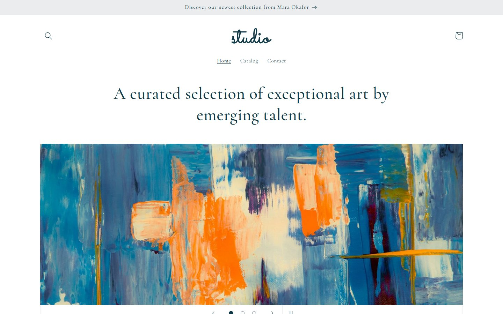
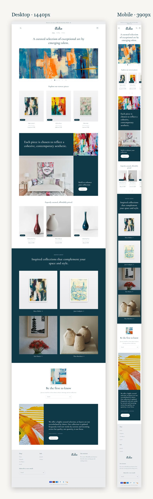
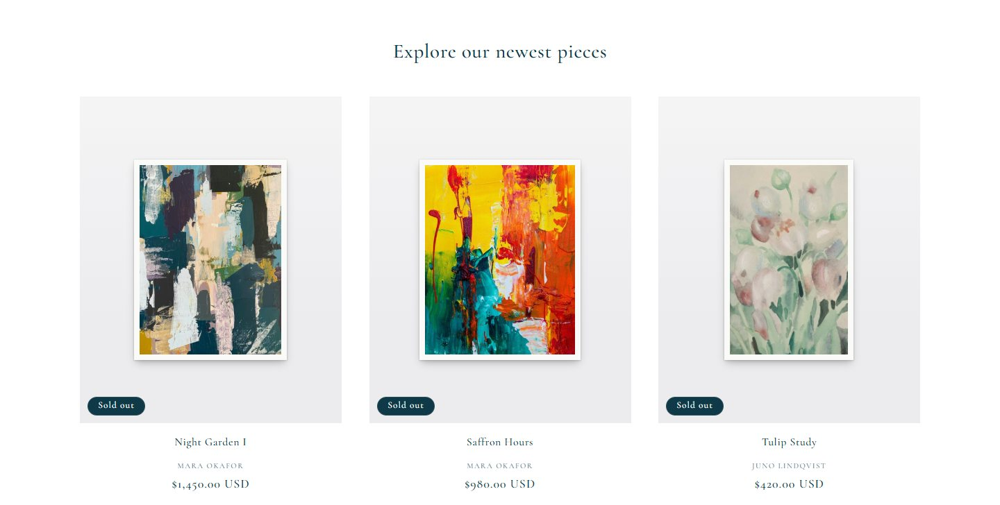
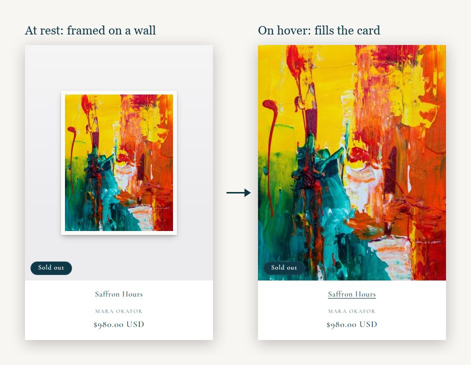

<div align="center">

# Studio — a Shopify theme, rebuilt section by section

**A pixel-matched recreation of Shopify's [Studio](https://themes.shopify.com/themes/studio/presets/studio) preset on Dawn v16,<br>plus a growing library of custom, editor-configurable sections written as vanilla-JS web components.**




</div>

---

## Why this exists

Studio is one of Shopify's free themes: a calm, gallery-style storefront for art. This project rebuilds its
homepage on a current Dawn release **to the pixel**. Every section was measured against the live demo with a
headless browser (computed styles and element boxes at 1440px and 390px) until the numbers matched. The project
also builds the reusable sections a real art store needs, each one fully configurable in the theme editor.

<table>
<tr>
<td width="50%" valign="top">

**What's inside**

- 🎨 &nbsp;Studio's design system on Dawn v16: Cormorant 500, 110% type scale, teal `#103948` palette
- 🧩 &nbsp;Custom sections as **web components**, with no libraries and no build step
- 🖼️ &nbsp;**Framed-artwork product cards**: art hangs on a wall and fills the card on hover
- ✍️ &nbsp;A built-in SVG **wordmark** used as the logo until you upload your own
- 🗂️ &nbsp;A seed catalog of 21 art products (4 fictional artists) to import in one go
- ♿ &nbsp;Keyboard-operable, `aria`-correct and `prefers-reduced-motion` aware

</td>
<td width="50%" valign="top">

**Fidelity, measured**

| Check | Result |
|---|---|
| Homepage section offsets @1440 | identical to the Studio demo |
| Section internals @1440 / @390 | within 1–2 px |
| Fonts, sizes, colors, spacing | copied from Studio's computed styles |
| `shopify theme check` | 0 errors (only Dawn's stock warnings) |

</td>
</tr>
</table>

## The homepage

<div align="center">

</div>

<br>

From top to bottom: announcement bar → header with wordmark → **hero slideshow** → **"Explore our newest pieces"** →
teal mosaic → **"Expertly curated"** → shop by artist → **newsletter** → founder note → footer.

<table>
<tr>
<td width="55%"></td>
<td width="45%"></td>
</tr>
<tr>
<td align="center"><sub>Collection tabs rendering Studio's 3-up grid</sub></td>
<td align="center"><sub>Framed cards: the frame grows to full-bleed on hover</sub></td>
</tr>
</table>

## The section library

Twelve reusable sections, one per day. Each one is a `<custom-element>` with its own Liquid file, stylesheet
and script, and exposes every string, color and spacing value in the editor.

| # | Section | Element | Status |
|:-:|---|---|:-:|
| 1 | **Hero with video** · slideshow of image/video slides, Studio control bar, pause/play | `<hero-video>` | ✅ |
| 2 | Shoppable image with product hotspots | `<shoppable-image>` | ⏳ |
| 3 | Before / after slider | `<before-after>` | ⏳ |
| 4 | Product comparison table | `<comparison-table>` | ⏳ |
| 5 | Testimonials carousel with star ratings | `<testimonials-carousel>` | ⏳ |
| 6 | FAQ accordion with FAQPage schema | `<faq-accordion>` | ⏳ |
| 7 | Logo / press bar | `<logo-bar>` | ⏳ |
| 8 | Countdown banner | `<countdown-banner>` | ⏳ |
| 9 | **Collection tabs** · lazy panels, `?tab=` deep links, peeking mobile carousel | `<collection-tabs>` | ✅ |
| 10 | Shoppable gallery | `<shoppable-gallery>` | ⏳ |
| 11 | Size guide modal | `<size-guide-modal>` | ⏳ |
| 12 | **Newsletter signup** · AJAX customer form, honeypot, consent, captcha fallback | `<newsletter-signup>` | ✅ |

The full plan, acceptance criteria and per-section notes live in [`PHASES.md`](PHASES.md).

<details>
<summary><b>What makes each built section tick</b></summary>

<br>

**`<hero-video>`**: Slides are blocks that can each hold an image, a Shopify-hosted video or a YouTube/Vimeo URL
(the image doubles as the poster). Videos sit in a `<template>` and only hydrate when their slide is current and
the section is near the viewport, so there is never a black flash. Autoplay pauses on hover, on focus, while a
block is selected in the editor, and for visitors who prefer reduced motion. One button stops both slide rotation
and video motion (WCAG 2.2.2).

**`<collection-tabs>`**: A WAI-ARIA tablist with roving `tabindex` and arrow/Home/End keys. Inactive panels ship
inside `<template>` and are only parsed (and their images requested) on first open. The active tab is mirrored to
`?tab=<handle>` with `replaceState`. Below 990px the grid becomes a scroll-snap row with a peeking card and a
`‹ 1/2 ›` pager driven by scroll position. Each tab can use a collection or a hand-picked product list. The tab bar
only appears with two or more tabs, so a single tab looks exactly like Studio's grid.

**`<newsletter-signup>`**: Progressive enhancement over ``. Without JS it posts normally and
Liquid renders the result. With JS it validates locally, posts with `fetch`, detects success through
`customer_posted=true`, surfaces Shopify's error text in an `aria-live` region and returns focus to the field.
A honeypot field silently swallows bots. If Shopify answers with its hCaptcha challenge, it falls back to a regular
submit.

</details>

## Beyond the sections

Small, targeted extensions to Dawn that the Studio look depends on. Each one is a theme setting, not a hard-code.

| Feature | Where | Notes |
|---|---|---|
| Framed artwork cards | `snippets/card-product.liquid`, `assets/studio.css` | *Theme settings → Framed artwork*: product types, wall/frame colour, frame size. Container-query units keep the frame proportional in any card size. |
| Built-in wordmark | `snippets/logo-wordmark.liquid` | "studio" lettered in Sacramento (OFL), converted to outlines, using `currentColor`. Used in the header and footer until a logo image is set. |
| Artist cards | `snippets/card-artist.liquid` | New *Artist* block for Collection list: name + representative product, linking to the vendor page. Works before per-artist collections exist. |
| Bundled demo images | `sections/image-with-text.liquid`, `sections/hero-video.liquid` | Pick a theme-asset photo when nothing is uploaded yet, served responsive via `asset_img_url`. |
| Footer links without menus | `sections/footer.liquid` | `Label \| /url` lines, used until a real menu is chosen. |
| Studio ⇄ Dawn v16 deltas | `assets/studio.css` | Every rule restores one measured difference between Studio's Dawn and v16, with a comment saying which. |

## Getting started

**Prerequisites:** [Shopify CLI](https://shopify.dev/docs/api/shopify-cli) 3.x, a development store, and Node 18+.

```sh
git clone https://github.com/Aymenjdily/Studio-liquid-shopify-theme.git
cd Studio-liquid-shopify-theme/section-library

shopify theme dev --store <your-store> --store-password <storefront-password>
# → http://127.0.0.1:9292
```

### Seed the demo catalog (optional, about 5 minutes)

The homepage is designed around artwork. To swap Shopify's sample snowboards for paintings, prints and ceramics:

1. **Products → Import** → upload [`docs/seed/art-products.csv`](docs/seed/art-products.csv). Shopify downloads the images itself.
2. Create an automated **Newest** collection (tag = `newest`) and point *Explore our newest pieces* at it.
3. Follow [`docs/seed/README.md`](docs/seed/README.md) for the menu and the optional type and artist collections.

> [!NOTE]
> The artists (Mara Okafor, Juno Lindqvist, Ines Duarte, Theo Marchetti) and the founder are fictional.
> All product and section photos come from Unsplash under the Unsplash License.

## Project structure

```
.
├── section-library/            # the theme: run `shopify theme dev` here
│   ├── sections/
│   │   ├── hero-video.liquid           # Phase 1
│   │   ├── collection-tabs.liquid      # Phase 9
│   │   ├── newsletter-signup.liquid    # Phase 12
│   │   └── …                           # Dawn v16 sections (some extended)
│   ├── snippets/
│   │   ├── card-artist.liquid          # artist cards for Collection list
│   │   └── logo-wordmark.liquid        # built-in SVG logo
│   ├── assets/
│   │   ├── hero-video.js · collection-tabs.js · newsletter-signup.js
│   │   ├── section-*.css               # one stylesheet per custom section
│   │   ├── studio.css                  # Studio-vs-Dawn-v16 deltas
│   │   └── *.jpg                       # bundled demo photography
│   ├── config/  layout/  locales/  templates/
├── docs/
│   ├── design-system.html      # visual reference for the Studio tokens
│   ├── seed/                   # product CSV + import guide
│   └── screenshots/            # images used in this README
└── PHASES.md                   # day-by-day build plan and progress log
```

## How the sections are built

- **Mobile-first CSS**: desktop is layered on with `min-width` queries, and sizes are in `rem` so they follow the theme's type scale like Studio.
- **Web components, deliberately light**: plain `customElements.define`, light DOM (so theme CSS applies), and work deferred until it's needed with `IntersectionObserver`, `<template>` and `defer`.
- **Everything is a setting**: text, colors, spacing and behavior are in the schema, and each section ships a preset so it can be added from the editor.
- **Accessibility is part of done**: keyboard paths, focus management, live regions and reduced motion are tested in a real browser before a phase is ticked off.

## Roadmap

- [x] Studio homepage, header and footer, pixel-matched
- [x] Phases 1, 9 and 12
- [ ] Phases 2 → 11 (shoppable image is next)
- [ ] Studio product and collection pages
- [ ] Editor GIFs for every section
- [ ] Lighthouse and accessibility pass across the library

## Credits

- **Design:** [Studio](https://themes.shopify.com/themes/studio/presets/studio) and [Dawn](https://github.com/Shopify/dawn) by Shopify. This project recreates the preset's look for learning purposes.
- **Photography:** [Unsplash](https://unsplash.com) contributors, used under the [Unsplash License](https://unsplash.com/license).
- **Wordmark lettering:** [Sacramento](https://fonts.google.com/specimen/Sacramento) by Brian J. Bonislawsky, SIL Open Font License.
- **Typeface:** [Cormorant](https://fonts.google.com/specimen/Cormorant) by Christian Thalmann, via Shopify's font library.

<div align="center">
<br>
<sub>Built one section at a time.</sub>
</div>
